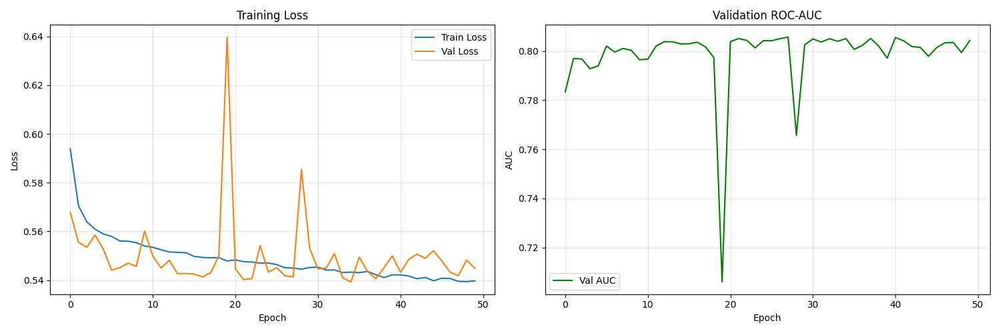
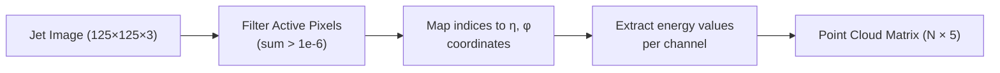
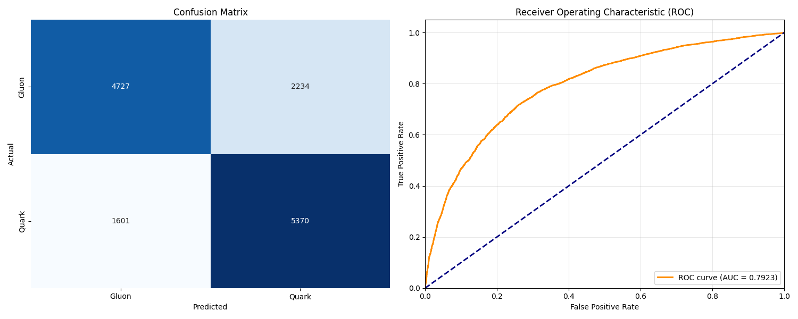

# Jet Classification via Graph Neural Network



A complete implementation of **ParticleNet** for classifying particle physics jets as **Quark** or **Gluon** using Graph Neural Networks (GNNs) and PyTorch Geometric. This approach converts detector images into sparse point clouds, represents them as relational graphs, and trains an EdgeConv-based model to identify jet substructure.

---

## Table of Contents
1. [Physics Background](#physics-background)
2. [Data Pipeline: Image to Point Cloud](#data-pipeline)
3. [Graph Representation](#graph-representation)
4. [Model Architecture](#model-architecture)
5. [Training Setup](#training-setup)
6. [Results](#results)
7. [Downloads](#downloads)
8. [Project Structure](#project-structure)
9. [Quickstart (Colab/Local)](#quickstart)

---

## 1. Physics Background

In a particle collider, a **quark** or **gluon** produced in a collision radiates a "spray" of particles called a **jet**. The goal is to determine which type of parton initiated the jet.

### Detector Coordinates: $\eta$ and $\phi$
Detectors don't use $(x, y, z)$. They use:
- **$\eta$ (pseudorapidity)**: How close a particle is to the beam axis.
- **$\phi$ (azimuthal angle)**: The angle around the beam axis.

These are the axes of the $125 \times 125$ jet images.

---

## 2. Data Pipeline: Image to Point Cloud

The dataset provides $125 \times 125 \times 3$ images (3 channels: Charged pT, Neutral pT, Photon pT). Since most of pixels are zero, we convert to a sparse point cloud.



### Coordinate Mapping
```python
eta = (row_idx - 62.0) / 125.0 * 0.8   # maps pixel row → η
phi = (col_idx - 62.0) / 125.0 * 0.8   # maps pixel col → φ
```

> [!IMPORTANT]
> The center offset is **62.0**

### Result
Each jet → a matrix of shape `(N, 5)` where each row is one particle hit:

```
[η, φ, pT_charged, pT_neutral, pT_photon]
```

---

## 3. Graph Representation

To model a jet as a graph, we define how particles relate to each other.

| Component | Definition |
| :--- | :--- |
| **Nodes** | Each particle hit → one node |
| **Node Features** | $[\eta, \phi, p_{T,ch}, p_{T,neu}, p_{T,ph}]$ — shape `(N, 5)` |
| **Edges** | K-Nearest Neighbours ($k=16$) in $(\eta, \phi)$ space |
| **Label** | `0` = Gluon, `1` = Quark |

### Why KNN?
- Captures **local jet substructure** (nearby particles that radiated together).
- Robust to variable jet density — every node always has exactly $k$ neighbours.
- The resulting `edge_index` tensor of shape `(2, E)` holds all connections simultaneously.

### PyTorch Geometric Data Object
```python
data = Data(
    x=tensor(N, 5),          # Node features
    edge_index=tensor(2, E), # KNN edges
    pos=tensor(N, 2),        # (η, φ) for spatial reasoning
    y=tensor([0 or 1])       # Label
)
```

---

## 4. Model Architecture

We implement **ParticleNet** using **EdgeConv** layers from PyTorch Geometric.

### EdgeConv: The Key Idea
For a node $i$ and neighbour $j$, instead of just looking at $x_i$ (like standard MLP), EdgeConv computes:
$$h_{ij} = \text{MLP}(x_i \;\|\; x_j - x_i)$$

Concatenating the relative difference $x_j - x_i$ lets the model understand **how particles relate spatially** and not just where they are.

### Dimension Trace

```
Input x          (N,  5)
  │
  ├─ Build edge features: [xi, xj-xi]   →  (E, 10)
  │
EdgeConv 1       (E, 10) → MLP → (E, 64) → Mean Aggregate → (N, 64)
  │
  ├─ Build edge features again           →  (E, 128)
  │
EdgeConv 2       (E, 128) → MLP → (E, 128) → Mean Aggregate → (N, 128)
  │
Global Mean Pool (N, 128) → (1, 128)   ← N disappears here
  │
FC Classifier    (1, 128) → (1, 64) → (1, 2)
  │
Softmax          (1, 2)  →  [P(Gluon), P(Quark)]
```

| Layer | Input Shape | Output Shape |
| :--- | :---: | :---: |
| EdgeConv 1 | `(N, 5)` | `(N, 64)` |
| EdgeConv 2 | `(N, 64)` | `(N, 128)` |
| Global Pool | `(N, 128)` | `(1, 128)` |
| FC Classifier | `(1, 128)` | `(1, 2)` |

Key design decisions:
- **BatchNorm** after each linear layer — added to fix exploding gradients observed in early training (see below).
- **Dropout (0.1)** before the final classifier to reduce overfitting.
- **Mean aggregation** per node over all k neighbours.

---

## 5. Training Setup

| Parameter | Value |
| :--- | :--- |
| **Dataset** | `quark-gluon_data-set_n139306.hdf5` (139,306 events) |
| **Split** | 80% Train / 10% Val / 10% Test |
| **Batch Size** | 32 |
| **Optimizer** | Adam (`lr = 0.001`) |
| **Loss** | CrossEntropyLoss |
| **KNN k** | 16 |
| **Platform** | Google Colab (GPU-ready) |

| **Gradient Clipping** | `max_norm = 1.0` |

### Training Stability: Fixing Exploding Gradients

During initial training, the model exhibited **exploding gradients** — the loss jumped to `nan` and the val AUC dropped sharply. This was caused by the EdgeConv MLP receiving large raw input values early in training, amplified across multiple layers.

Two measures were introduced to resolve this:

**1. Batch Normalization** (inside the model)
BatchNorm was added after every `Linear` layer in both EdgeConv blocks and the FC classifier. It normalises the activations after each layer, preventing values from growing unbounded as they pass through the network.

```python
nn.Sequential(
    nn.Linear(2*input_dim, 64),
    nn.BatchNorm1d(64),  # ← keeps activations in check
    nn.ReLU(),
    nn.Linear(64, 64),
    nn.BatchNorm1d(64),  # ← and again
    nn.ReLU()
)
```

**2. Gradient Clipping** (in the training loop)
Even with BatchNorm, occasional large gradients appeared in mid-training (visible as spikes at epochs ~20 and ~28). Gradient clipping caps the gradient norm before each parameter update:

```python
loss.backward()
torch.nn.utils.clip_grad_norm_(model.parameters(), max_norm=1.0)  # ← clip
optimizer.step()
```

Together these two techniques eliminated `nan` loss and produced a stable, monotonically-decreasing training loss curve.

### Other Key Features
- **Lazy loading**: The `JetGraphDataset` reads and converts one jet at a time from HDF5. No pre-loading of all 139k graphs into RAM.
- **Checkpointing**: Saves `latest_checkpoint.pth` (model + optimizer + history) every epoch for resumable training.
- **Best model**: Separately saves `best_model.pth` whenever validation AUC improves.

---

## 6. Results

*Training results after 50 epochs on Google Colab (T4 GPU).*

### Training Curves


**Key Observations:**
- Train Loss decreased from `0.595 → 0.543` over 50 epochs.
- Val AUC settled in the **0.80–0.81 range** after epoch 10, with two temporary dips at epochs ~20 and ~28 (learning rate instability — handled by checkpointing).

### Test Performance



| Metric | Value |
| :--- | :--- |
| **Test AUC** | **0.7923** |
| **Gluon Recall** | 68.0% (4727 / 6961) |
| **Quark Recall** | 77.0% (5370 / 6971) |

### Training Progression

| Epochs | AUC | Gluon Recall | Quark Recall |
| :---: | :---: | :---: | :---: |
| 10 | 0.7726 | 76.9% | 64.1% |
| **50 (Final)** | **0.7923** | 68.0% | **77.0%** |

---

## 7. Downloads

All trained model weights and result plots are available on Google Drive:

📁 **[GNN Results & Model Weights (Google Drive)](https://drive.google.com/drive/folders/1CKtBlmenio5FWSoVzFSbjxfraHejSbmY?usp=sharing)**

| File | Description |
| :--- | :--- |
| `best_model.pth` | Best model weights (highest Val AUC) |
| `latest_checkpoint.pth` | Full checkpoint with optimizer state + history (resume training) |
| `training_curves.png` | Loss and AUC curves over 50 epochs |
| `test_performance.png` | Confusion Matrix and ROC curve on test set |

---