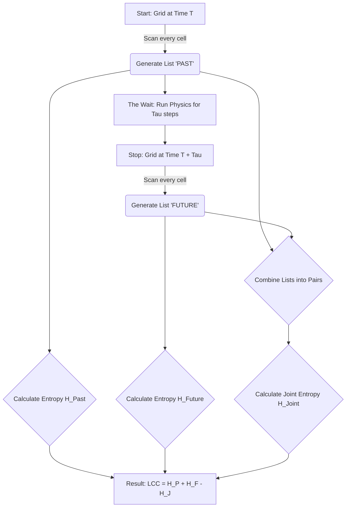

### **Visualizing Light-Cone Complexity (LCC) & Simulation Timeline**

This document provides a visual and conceptual breakdown of how Light-Cone Complexity (LCC) is calculated in the Coffee Automaton simulation, including the algorithm, data transformation, and the specific timing of the simulation steps.

---

### **1. The "Cookie Cutter" (The Neighborhood)**

To measure complexity, we do not look at single pixels. We look at **Patterns**.
We use a **Von Neumann Neighborhood** (a "plus sign" shape).

Imagine a generic Grid. We place a **Red Cross** over a specific cell (Center). We ignore the center and only record the **4 Neighbors**.

```text
      [N]             (N)orth
       |
[W]--[Center]--[E]    (W)est, (E)ast
       |
      [S]             (S)outh

Pattern String = "N E S W" (e.g., "1 0 1 0")

```

---

### **2. The Algorithm Flow Chart**

This is the step-by-step process happening inside the `calculate_LCC` function.



---

### **3. The Data Transformation (Visualized)**

This is the most critical part: **How we turn a Grid into a List.**

Imagine a tiny  grid. We wrap around edges (modulo arithmetic), so every cell has exactly 4 neighbors.

#### **Step A: The "Past" Snapshot (Time )**

We slide our "Cookie Cutter" over every single cell (from index 0 to 8).

| Grid (Time 0) | Cookie Cutter View (Example) | Recorded String |
| --- | --- | --- |
| Cell (0,0) | Neighbors are 1, 0, 1, 0 | `"1010"` |
| Cell (0,1) | Neighbors are 0, 0, 1, 1 | `"0011"` |
| ... | ... | ... |
| Cell (2,2) | Neighbors are 1, 1, 0, 0 | `"1100"` |

**Result:** `List_Past = ["1010", "0011", ..., "1100"]`

#### **Step B: The "Future" Snapshot (Time )**

We let the simulation run. The particles swap and move. The grid changes.
We look at the **exact same coordinates** again.

| Grid (Time 10) | Cookie Cutter View (Example) | Recorded String |
| --- | --- | --- |
| Cell (0,0) | Neighbors are now 1, 0, 1, 1 | `"1011"` |
| Cell (0,1) | Neighbors are now 0, 1, 1, 1 | `"0111"` |
| ... | ... | ... |
| Cell (2,2) | Neighbors are now 1, 1, 0, 0 | `"1100"` |

**Result:** `List_Future = ["1011", "0111", ..., "1100"]`

---

### **4. The Logic: Why does this measure Complexity?**

We now have pairs of strings. We ask: **"Did the Past string predict the Future string?"**

#### **Case 1: The "Order" Phase (Solid Blocks)**

* **Cell (0,0):** Past was `"0000"`. Future is `"0000"`.
* **Conclusion:** The prediction is perfect, but the data is boring.
*  is low.
* **LCC is Low.**


#### **Case 2: The "Chaos" Phase (Random Noise)**

* **Cell (0,0):** Past was `"1010"`. Future is `"0111"` (Total surprise).
* **Conclusion:** The Past tells us *nothing* about the Future.
*  is High (lots of variety).
* But the Joint Entropy subtracts it all away because there is no link.
* **LCC is Low.**


#### **Case 3: The "Complexity" Phase (Swirls)**

* **Cell (0,0):** Past was `"1100"` (Vertical Line). Future is `"0110"` (Line moved right).
* **Conclusion:** We see a **pattern of change**. The "Vertical Line" reliably becomes a "Shifted Vertical Line."
*  is High (interesting shapes).
* The Prediction is Good (Low Joint Entropy).
* **LCC is High.**


---

### **5. Simulation Timeline: Micro-Time vs. Macro-Time**

The simulation does not run for `tau * phase`. Instead, think of it as a continuous marathon where we stop occasionally to take a short "video" of the system.

The "switch" (simulation step) happens in two distinct modes during the loop.

#### **The Two Modes of Simulation**

In every single `phase` of the loop, two things happen back-to-back:

1. **Mode A: The Measurement ( steps)**
* **What happens:** We run `sim.step()` for `tau` times.
* **Purpose:** To let the "Past" evolve slightly into the "Future" so we can check correlation (LCC).
* **Duration:** Short ( swaps). This is "Micro-Time."


2. **Mode B: The Evolution Gap ( steps)**
* **What happens:** We run the simulation aggressively without measuring.
* **Purpose:** To physically push the system from **Order  Complexity  Chaos**. If we skipped this, we would just measure the exact same state over and over.
* **Duration:** Long ( swaps). This is "Macro-Time."


#### **Visualizing the Process**

We are interleaving "Testing" and "Training."

```mermaid
graph TD
    Start((Start)) --> Phase0
    
    subgraph "Phase 0 (Order)"
        M0[Measurement Window<br/>(Run 50 Steps)]
        E0[Evolution Gap<br/>(Run 12,500 Steps)]
        M0 -->|Calc LCC| E0
    end
    
    subgraph "Phase 1 (Mixing)"
        E0 --> M1[Measurement Window<br/>(Run 50 Steps)]
        E1[Evolution Gap<br/>(Run 12,500 Steps)]
        M1 -->|Calc LCC| E1
    end
    
    subgraph "Phase 10 (Chaos)"
        E1 -.-> M10[Measurement Window<br/>(Run 50 Steps)]
        E10[Evolution Gap<br/>(Run 12,500 Steps)]
        M10 -->|Calc LCC| E10
    end

    E10 --> End((End))

```

#### **The Math: Total Swaps per Phase**

If your grid size is N = 50

1. **Measurement (tau): 50 swaps** 


2. **Evolution (Mixing): 5x(50x50)**


**Total Swaps per Phase: 12500 + 50 = 12550 swaps**


**Total Experiment (11 Phases): 11 x 12550 = 138050 swaps**


#### **The Analogy for Machine Learning**

Since you are studying Reinforcement Learning and Deep Learning, this structure mirrors a standard training loop:

* **The Evolution Gap** is like the **Training Epochs**. You run the heavy computation to change the weights (or in this case, mix the particles).
* **The Measurement Window ()** is like the **Validation Step**. You pause training briefly to run a forward pass and check metrics, then resume training.