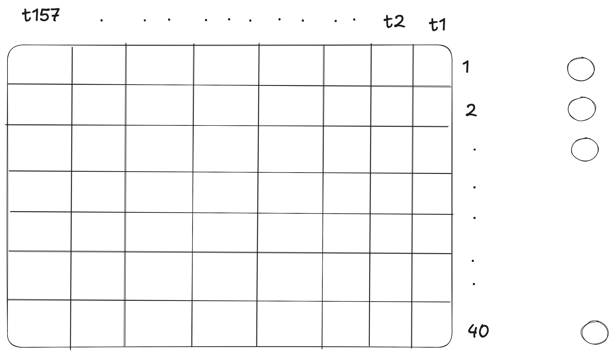

# What is an audio file really?

A `.wav` file is just:

> A list of numbers.

If the sample rate = **16,000 Hz**, that means:

- 16,000 numbers per second  
- Each number = how far the speaker membrane moved  
- Bigger number → louder sound  

So a 1-second clip looks like: [0.01, 0.03, -0.02, -0.08, 0.05, ... 16000 numbers]

That’s it.

---

# Why not feed those 16,000 numbers directly into an RNN?

Because:

- Too long  
- Too noisy  
- Hard to learn from raw wiggles  
- RNN would struggle with 16,000 time steps  

So we compress it into something smarter.

---

# What humans hear vs what the file stores

The file stores raw vibration numbers.

But humans hear:
- Pitch  
- Tone  
- Frequency  
- Changes over time  

So we transform the waveform into something closer to what we hear.

---

# Step 1: Break sound into small chunks

Instead of 1 second at once, we break it into tiny windows:

Example:
- 25 milliseconds at a time  
- Move forward 10 milliseconds each step  

So instead of 16,000 raw points, we get:

~100 small slices of sound.

Now the sequence is:
* frame_1
* frame_2
* frame_3
* ...
* frame_100

This is perfect for an RNN:

→ each frame = one time step

---

# What is a Spectrogram?

For each small chunk, we ask:

> How much of each frequency is present?

- Low frequencies = bass  
- High frequencies = sharp sounds  

So instead of raw numbers, each frame becomes something like: [0.1, 0.3, 0.05, 0.8, 0.2, ...]

Each value = strength of a certain frequency.

Now your input looks like:

* Time Step 1 → 40 frequency values
* Time Step 2 → 40 frequency values
* Time Step 3 → 40 frequency values
* ...

This is called a **spectrogram**.

---

# What is a Mel Spectrogram?

Humans don’t hear all frequencies equally.

We hear low frequencies more clearly.

So we compress frequencies into “mel bins” that match human hearing.

Instead of 257 frequency values, we use maybe 40.

So each time step becomes: 40 numbers

That’s your feature vector per time step.

---

# What is Log?

Sound power varies a lot.

We take log to:
- Reduce big value differences  
- Make learning easier  
- Match how humans perceive loudness  

So:

> Spectrogram → Mel → Log

Now you have something very learnable.

---

# Final Shape After Processing

Instead of 16,000 numbers:

You now have: (100 time steps, 40 features)

That’s PERFECT for an RNN.

---

#  Why This Helps RNNs

Now the RNN sees:

- Frame 1 → beginning sound  
- Frame 2 → next sound  
- Frame 3 → transition  
- ...  
- Frame 100 → ending  

It learns how sounds evolve over time.

This is exactly what RNNs are designed for.

---

Raw Audio (yes.wav)
    ↓ [load & convert to mono]
(1, 16000) samples
    ↓ [pad/trim to 1 second]
(1, 16000) samples
    ↓ [mel spectrogram]
(1, 40, 157) power spectrum
    ↓ [convert to dB]
(1, 40, 157) log-mel spectrogram
    ↓ [squeeze & transpose]
(157, 40) features
    ↓ [batch with others]
(32, 157, 40) → Ready for RNN!

<table width="100%">
  <tr>
    <th width="50%">Input Transformation</th>
    <th width="50%">Feature Pipeline</th>
  </tr>
  <tr>
    <td></td>
    <td></td>
  </tr>
</table>