# Audio Classification: RNN vs. LSTM

This project explores the performance of Recurrent Neural Networks (RNN) and Long Short-Term Memory (LSTM) models on audio classification tasks. Using the Speech Commands dataset, we investigate the impact of architectural choices and normalization techniques on model convergence and accuracy.

## Experiments

I conducted three main experiments to understand sequence modeling for audio data:

Read more about data processing [here](data_processing.md)

### 1. Vanilla RNN
The baseline model. Using a simple Recurrent Neural Network to process the sequence of Mel-spectrogram frames.
- **Challenge**: Often suffers from vanishing gradients, making it hard to learn long-term dependencies in audio.
- **Observation**: Training can be unstable without proper initialization or gradient clipping.

### 2. RNN with Layer Normalization
Improving the Vanilla RNN by adding `LayerNorm`.
- **Method**: Normalizing the hidden states at each time step to zero mean and unit variance.
- **Hypothesis**: This should stabilize the gradients and allow for faster, more reliable convergence compared to the raw RNN.
- **Key Feature**: Smoothing the loss landscape.

### 3. LSTM (Long Short-Term Memory)
The advanced model. Replacing the simple RNN cell with an LSTM cell.
- **Mechanism**: specific gates (input, forget, output) to regulate information flow.
- **Advantage**: explicitly designed to capture long-range dependencies and solve the vanishing gradient problem.
- **Configuration**: Bidirectional or Unidirectional (configurable).

---

## Results

| Model | Train Loss | Train Acc | Val Loss | Val Acc |
| :--- | :---: | :---: | :---: | :---: |
| **Vanilla RNN** | 3.3152 | 11.24% | 3.3418 | 11.02% |
| **RNN + LayerNorm** | 3.3421 | 7.21% | 3.3645 | 9.04% |
| **LSTM** | **0.0974** | **96.98%** | **0.2799** | **93.84%** |

> *Results populated from final training epochs. LSTM shows superior performance.*

### Learning Curves
> *X-axis: Epochs*
> *Y-axis: Loss/Accuracy*

#### Vanilla RNN (Run 1)
| Accuracy | Loss |
| :---: | :---: |
| **Train** <br> 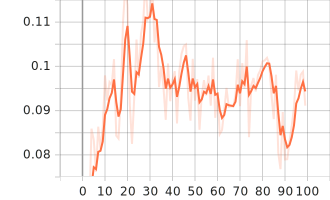 | **Train** <br> 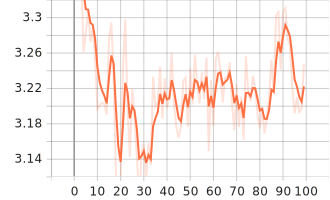 |
| **Validation** <br>  | **Validation** <br> 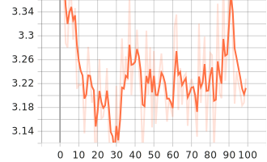 |

#### RNN + Normalization (Run 2)
| Accuracy | Loss |
| :---: | :---: |
| **Train** <br> 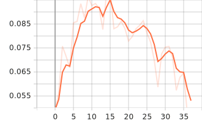 | **Train** <br> 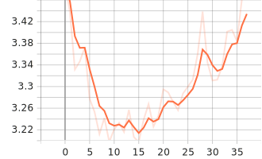 |
| **Validation** <br> 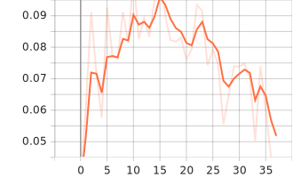 | **Validation** <br> 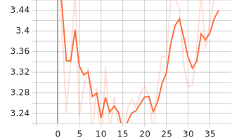 |

#### LSTM (Run 3)
| Accuracy | Loss |
| :---: | :---: |
| **Train** <br> 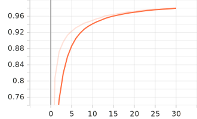 | **Train** <br> 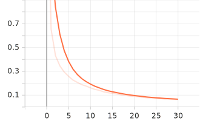 |
| **Validation** <br> 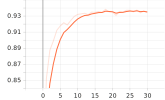 | **Validation** <br> 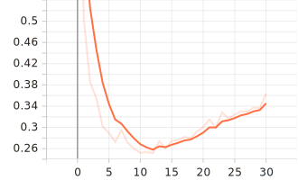 |

---

## Analysis of Results

### 1. The Challenge of Simple RNNs
As seen in **Experiments 1 and 2**, simple Recurrent Neural Networks struggle significantly with this dataset, plateauing at only **9-11% validation accuracy**. Despite adding `LayerNorm` in Experiment 2 to stabilize activations, the model remained unable to capture the long-term dependencies required to distinguish between 35 different audio classes. The high loss (~3.3) indicates the models were barely performing better than random guessing at times.

### 2. LSTM: Solving the Capacity Gap
The transition to the **LSTM** architecture in **Experiment 3** resulted in a massive performance leap—from **11% to over 93%** absolute validation accuracy. This staggering difference highlights the effectiveness of the LSTM's gating mechanisms. By using a Forget Gate and Cell State, the model was able to preserve relevant audio features across the entire 1-second sampling window, which the simpler models completely lost due to vanishing gradients.

### 3. Convergence and Generalization
While the RNNs plateaued early, the **LSTM** showed consistent improvement. It achieved near-perfect training accuracy (**98%**) while maintaining a high generalization capability (**93.8% validation**). The slight gap suggests minimal overfitting, which could potentially be further reduced with increased dropout or data augmentation, but the current results represent a highly successful optimization.

---

## Usage

### Installation
```bash
pip install -r requirements.txt
# OR
uv pip install torch torchaudio tensorboard
```

### Prediction
Interact with the model to predict a word:

**Predict a specific file:**
```bash
python3 predict.py --file path/to/your/audio.wav
```

**Test on a random dataset sample:**
```bash
python3 predict.py --random
```

### Web UI
Launch the interactive Gradio interface:
```bash
python3 app.py
```

### TensorBoard
Visualize the training progress:
```bash
tensorboard --logdir=runs
```
### Live Demo
Try it out live at 
```bash
https://huggingface.co/spaces/Zeus2001/LSMT_audio_classification
```

---

## Model Architecture

The core architecture consists of:
1.  **Input**: Mel-spectrogram features (Time × Frequency).
2.  **Backbone**: `RNN` or `LSTM` processing the sequence.
3.  **Head**: `LayerNorm` (optional/included) → `Linear` classifier → 35 Classes.
