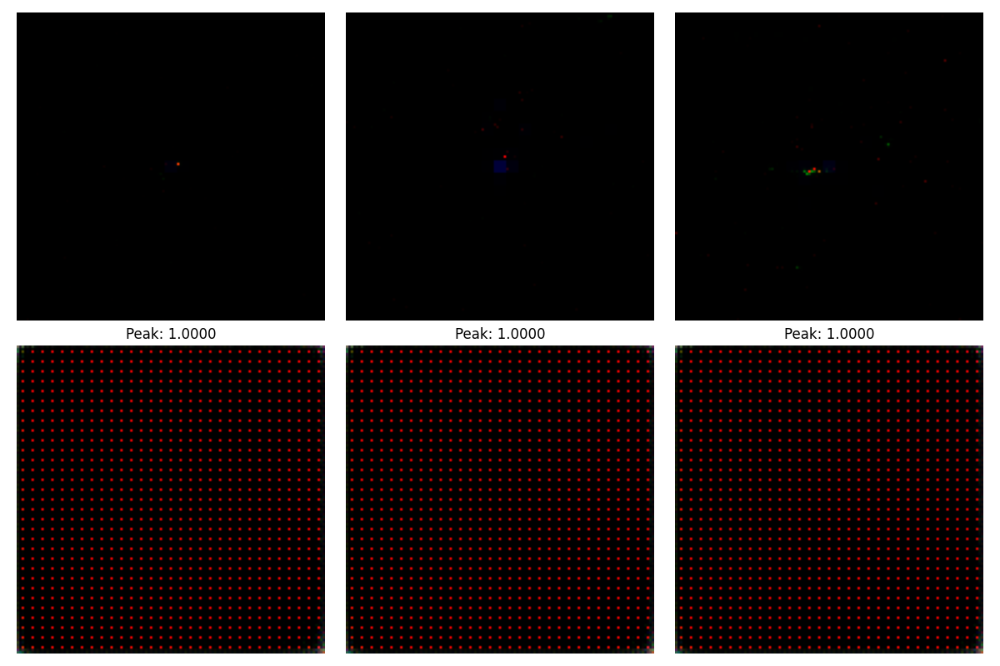
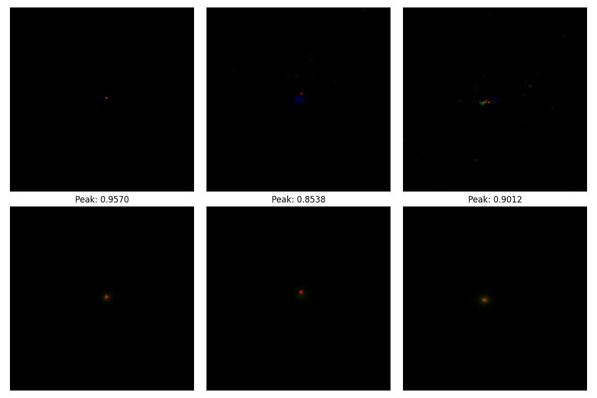
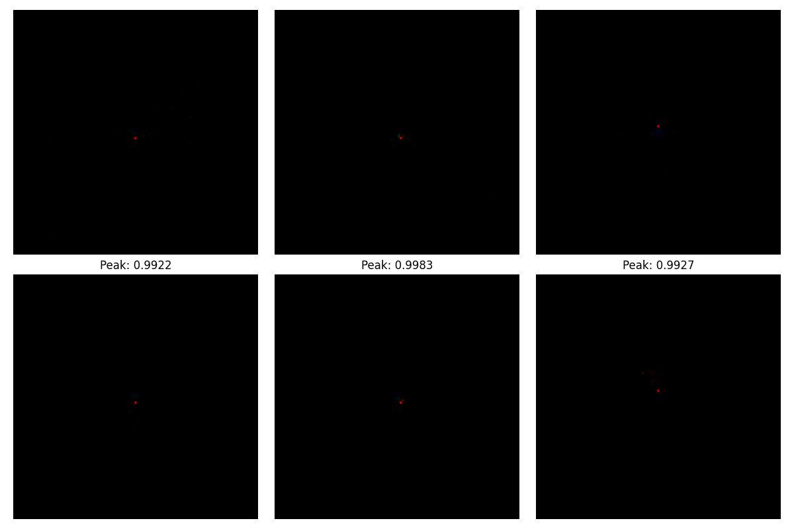
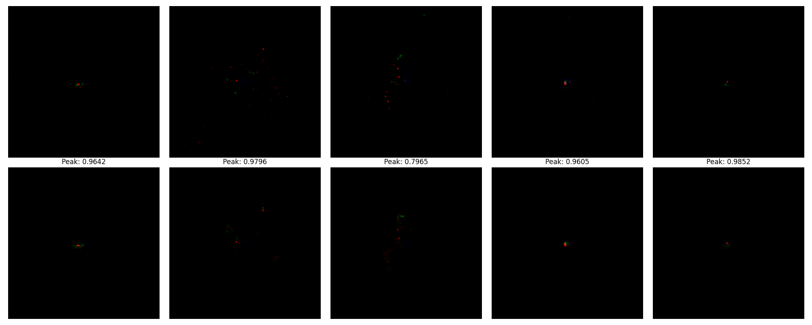
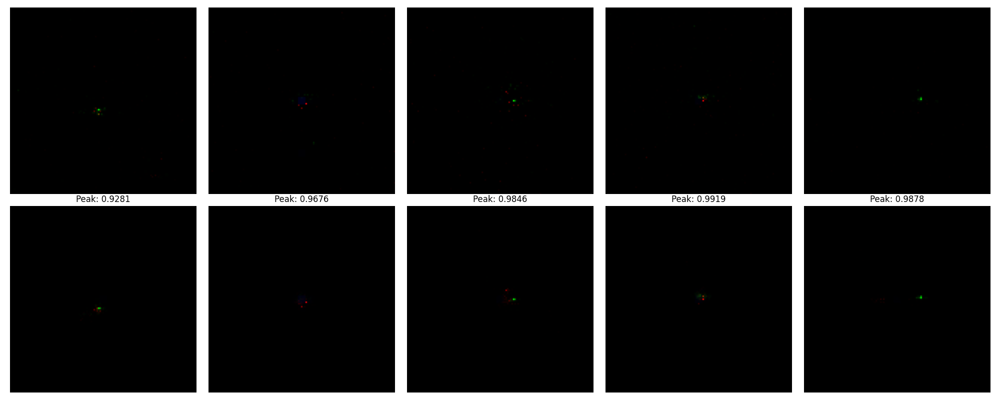

# VAE-Based Reconstruction of High-Throughput Jet Calorimetry Data

This repository provides a implementation of a Variational Autoencoder (VAE) for the reconstruction of sparse jet calorimetry images.
Dataset : https://drive.google.com/file/d/1WO2K-SfU2dntGU4Bb3IYBp9Rh7rtTYEr/view?usp=sharing
Model weights : https://drive.google.com/drive/folders/1dnEwKAKgXvQVS4xjmMeWGXDtconDEdTo?usp=share_link

## Dataset: Jet Calorimetry Images

The dataset consists of 2D energy depositions ("Jet Images") from calorimetry sensors.
- **Input Geometry**: $125 \times 125$ pixels, 3-channel (representing different calorimetry layers or features).
- **Signal Sparsity**: Inputs are $>99\%$ sparse. Information is localized in high-intensity clusters.
- **Normalization**: Pixel values are normalized to $[0, 1]$ relative to the peak transverse energy ($E_T$) per event.

## Model Architecture

The VAE architecture is designed to compress sparse spatial information into a dense latent representation while preserving critical energy substructures.

### Encoder (Inference Network)
Reduces the $125 \times 125 \times 3$ input into a 128-dimensional latent space.
- **Convolutional Layers**: Four layers with increasing filter counts (32, 64, 128, 256), kernel size 4, and stride 2.
- **Activation**: ReLU (Rectified Linear Unit) used throughout.
- **Latent Mapping**: Two parallel fully connected layers outputting vectors for the mean ($\mu$) and log-variance ($\log \sigma^2$).

### Decoder (Generative Network)
Reconstructs the original image from the 128-dimensional latent vector $z$.
- **Latent Expansion**: Fully connected layer mapping $z$ back to the squeezed convolutional feature map dimensions.
- **Transpose Convolutions**: Four layers (256, 128, 64, 32 filters) with ReLU activations.
- **Output Layer**: Final transpose convolution followed by a **Sigmoid** activation to squash outputs into the $[0, 1]$ range.

## Technical Methodology & Optimizations

### 1. In-Memory Data Acceleration (Load-to-RAM)
To maximize GPU duty cycles, the implementation utilize a Load-to-RAM strategy. The entire HDF5 dataset (~700MB) is cached in system memory during object initialization.

### 2. Weighted MSE Loss Formulation
To address the "zero-pixel bias" in sparse datasets, a weighted Mean Squared Error (MSE) objective is employed:
- **Optimization**: A $10\times$ penalty weight is applied to non-zero target pixels. This prevents the model from converging to a trivial "black image" global minimum.

### 3. Beta-Scheduling and Regularization
The model employs a $\beta$-VAE formulation with a specific focus on reconstruction fidelity over latent space normality.
- **Beta Cap**: The KL-divergence weight $\beta$ is capped at **0.01** (reduced from 1.0).
- **Rationale**: Minimal $\beta$ values prevent posterior collapse and ensure the reconstruction objective remains dominant, allowing for sharp, high-intensity energy recovery.

## Training & Execution

### Hyperparameters
- **Latent Dimension**: 128
- **Optimizer**: Adam ($LR = 2 \times 10^{-4}$)
- **Batch Size**: 1024 (recommended for H100)
- **Beta Warmup**: Linear schedule up to the 0.01 cap.

### Monitoring & Checkpointing
- **Telemetry**: Loss history (Total, Reconstruction, and KL) is logged and plotted per epoch.
- **Checkpoints**: High-frequency saving of `vae_last.pt` (latest state) and `vae_best.pt` (lowest validation loss).
- **Visual Validation**: Reconstructed samples are saved every 10 epochs with automatic intensity scaling for manual inspection.

## Reconstruction Results

The following images demonstrate the model's ability to reconstruct sparse jet calorimetry data. The reconstruction quality significantly improves over time, moving from blurry approximations to sharp, pixel-accurate energy recovery.

### Training Progression ( reconstruction of validation samples)
(Note: Upper row is the original image, lower row is the reconstructed image)
#### Epoch 1

#### Epoch 200

#### Epoch 500

#### Epoch 750

#### Epoch 1000

---
