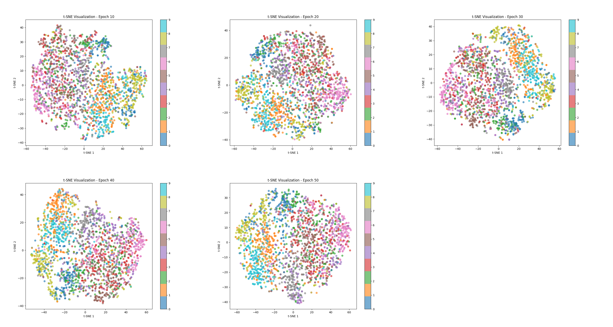
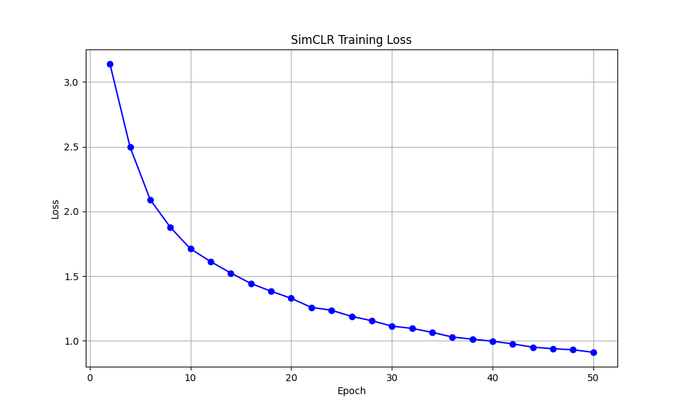

# SimCLR: A Simple Framework for Contrastive Learning of Visual Representations

Paper link : https://arxiv.org/pdf/2002.05709

This repository contains a clean, modular implementation of **SimCLR** (Simple Contrastive Learning) applied to the CIFAR-10 dataset. The implementation is optimized for Mac (supporting `mps` acceleration) and includes built-in tools for checkpointing and visual representation analysis.

## Features
- **ResNet-18 Backbone**: Uses a standard ResNet-18 as the base encoder.
- **MLP Projection Head**: A 2nd-layer MLP that maps representations to a space where contrastive loss is applied.
- **NT-Xent Loss**: Normalized Temperature-scaled Cross Entropy loss for self-supervised learning.
- **Mac Optimized**: Automatic hardware detection for Apple Silicon GPU (`mps`) or NVIDIA GPU (`cuda`).
- **Live Visualization**: Periodic t-SNE projections of the learned feature space to monitor clustering performance.
- **Checkpointing**: Periodic saving of model and optimizer states.

---

## Results

### Feature Representation Evolution (t-SNE)
The following grid shows how the model learns to cluster the CIFAR-10 classes (without using any labels) over 50 epochs. As training progresses, you can see distinct clusters forming for different object categories.



### Training Loss
The NT-Xent loss convergence over 50 epochs:



---

## Getting Started

### Prerequisites
Ensure you have `uv` installed, then set up the environment:
```bash
uv sync
```

### Running Training
To start the self-supervised pre-training:
```bash
uv run python -m simCLR.train
```

---

## Repository Structure
- `train.py`: Main training loop with visualization and checkpointing logic.
- `models.py`: Model architecture (ResNet + Projection Head).
- `losses.py`: NT-Xent loss implementation.
- `datasets.py`: Data augmentation and view generation.
- `plots/`: Generated t-SNE visualizations and loss curves.
- `checkpoints/`: Periodic model saves.

